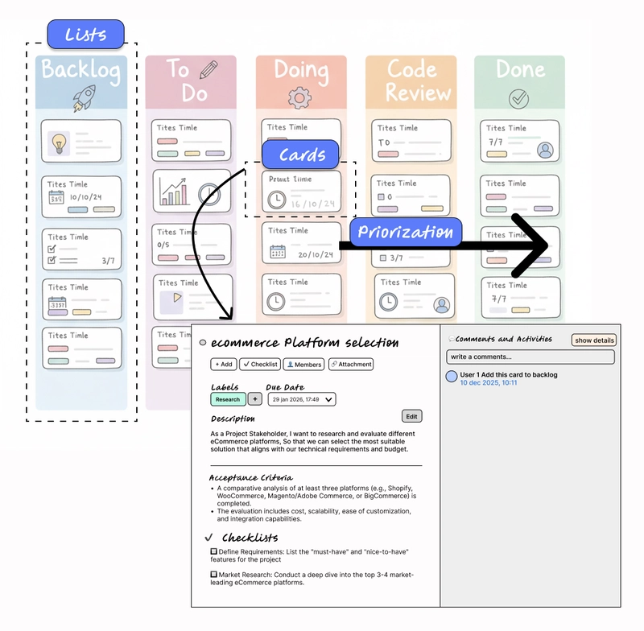
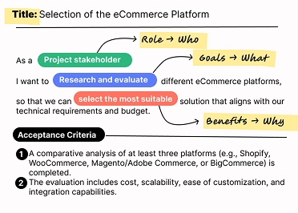

# Phân tích dự án dựa trên dữ liệu: Phân tích dự án Trello Kanban bằng AI trên AWS Bedrock

> **📖 Bài viết gốc**: [Link to original article (placeholder)]  
> **👤 Tác giả**: Romina Elena Mendez Escobar - AI/ML Specialist  
> **📅 Ngày xuất bản**: 23/12  
> **🌐 Nguồn**: [Medium/Tech Blog (placeholder)]  
> **👨‍💻 Người dịch**: Lư Hiếu Trung - FCJ Intern  
> **📅 Ngày dịch**: 24/12/2025  
> **⏱️ Thời gian đọc**: 12 phút

---

## 📋 Tóm tắt

Bài viết trình bày một giải pháp sáng tạo để nâng cao khả năng phân tích và diễn giải dự án Trello Kanban bằng cách tích hợp trí tuệ nhân tạo tạo sinh trên AWS Bedrock. Với các dự án phần mềm phức tạp, việc hiểu trạng thái thực sự và xác định rủi ro sớm trở nên khó khăn do lượng lớn dữ liệu phi cấu trúc. Giải pháp này tận dụng siêu dữ liệu nhiệm vụ và phân tích ngữ nghĩa trong các bình luận (như sự mơ hồ, phụ thuộc ngầm, hoặc mở rộng phạm vi) để cung cấp cái nhìn khách quan, cảnh báo sớm và hỗ trợ ra quyết định dựa trên dữ liệu. Phương pháp này dựa trên nguyên tắc Kanban và cấu trúc câu chuyện người dùng để dễ dàng diễn giải bằng máy móc. Kiến trúc tham chiếu mô tả cách dữ liệu được trích xuất từ Trello, làm phong phú bằng ngữ cảnh, phân tích bởi Amazon Nova trên AWS Bedrock và sau đó tạo thành báo cáo PDF chuyên nghiệp, được phân phối tự động qua email. Bài viết cũng đi sâu vào các điều kiện tiên quyết (API Trello, vai trò IAM, cấu hình SES) và các bước triển khai chi tiết, nhấn mạnh việc tối ưu hóa chi phí token và tính linh hoạt của giải pháp cho các công cụ quản lý dự án khác.

**🎯 Đối tượng đọc**: Developers, Project Managers, AI/ML Engineers  
**📊 Độ khó**: Intermediate  
**🏷️ Tags**: trí tuệ nhân tạo, AWS, học máy, Python, Kanban, Trello, Microservices, CI/CD

---

## 📚 Mục lục

- [Phần 1: Giới thiệu](#phần-1-giới-thiệu)
- [Phần 2: Bảng Kanban và Trello](#phần-2-bảng-kanban-và-trello)
- [Phần 3: AWS Bedrock và Amazon Nova](#phần-3-aws-bedrock-và-amazon-nova)
- [Phần 4: Kiến trúc Tham chiếu](#phần-4-kiến-trúc-tham-chiếu)
- [Phần 5: Hướng dẫn Triển khai](#phần-5-hướng-dẫn-triển-khai)
- [Phần 6: Kết luận](#phần-6-kết-luận)
- [Glossary - Thuật ngữ](#glossary---thuật-ngữ)
- [Tài liệu tham khảo](#tài-liệu-tham-khảo)

---

## Phần 1: Giới thiệu

Các dự án phần mềm hiện đại thường liên quan đến nhiều nhóm phân tán làm việc trên các sáng kiến ​​có độ phức tạp cao, với các bản phát hành thường xuyên và các bản vá lỗi liên tục trong quá trình sản xuất. Mặc dù các công cụ như bảng Kanban giúp tổ chức các nhiệm vụ, các dự án lớn và quy trình làm việc, nhưng chúng cũng tạo ra một lượng lớn dữ liệu phi cấu trúc dưới dạng nhận xét, thay đổi trạng thái và dòng thời gian.

Khi số lượng các nhiệm vụ và người đóng góp phụ thuộc lẫn nhau tăng lên, việc hiểu được trạng thái thực sự của dự án và xác định sớm các rủi ro hoặc điểm nghẽn trở nên ngày càng khó khăn. Kết quả là, phân tích thủ công tốn nhiều thời gian và thường mang tính chủ quan, hạn chế việc ra quyết định kịp thời và khách quan.

Trong bài viết này, tôi trình bày một trường hợp sử dụng thực tiễn tận dụng các dịch vụ AWS và trí tuệ nhân tạo tạo sinh để nâng cao khả năng phân tích và diễn giải dự án. Bằng cách phân tích siêu dữ liệu nhiệm vụ và phát hiện các mẫu ngữ nghĩa trong phần bình luận (như sự mơ hồ, phụ thuộc ngầm, thiếu định nghĩa hoặc sự mở rộng phạm vi), AI cho phép đưa ra những hiểu biết khách quan hơn, cảnh báo sớm và ra quyết định dựa trên dữ liệu.

## Phần 2: Bảng Kanban và Trello

### Tìm hiểu về bảng Kanban và Trello

**Kanban** là một phương pháp quản lý dự án trực quan có nguồn gốc từ hệ thống sản xuất của Toyota. Phương pháp này tập trung vào việc hạn chế công việc đang tiến hành và cho phép phân phối liên tục bằng cách thể hiện các hạng mục công việc ở các giai đoạn khác nhau của quy trình làm việc.

**Trello** là một công cụ quản lý dự án trực tuyến được sử dụng rộng rãi, áp dụng **các nguyên tắc Kanban** thông qua các thẻ boards, bảng lists và cards câu chuyện người dùng. Mỗi thẻ thường đại diện cho một nhiệm vụ, tính năng hoặc câu chuyện người dùng, và bao gồm không chỉ trạng thái mà còn cả văn bản mô tả, nhận xét và lịch sử thay đổi theo thời gian.
Mặc dù bảng Kanban chủ yếu được thiết kế để con người cộng tác, chúng cũng tạo ra một nguồn dữ liệu văn bản và ngữ cảnh phong phú có thể được phân tích bằng lập trình.



### Câu chuyện người dùng như một cấu trúc dữ liệu

Một câu chuyện người dùng được định nghĩa rõ ràng thường tuân theo một cấu trúc nhất quán:

*   **Ai**: người yêu cầu (Với tư cách là…)
*   **Cái gì**: mục tiêu (Tôi muốn…)
*   **Tại sao**: Mục đích (Để…)
*   **Tiêu chí chấp nhận**: các điều kiện rõ ràng để hoàn thành



Cấu trúc này không chỉ hữu ích cho việc điều phối các nhóm, mà còn cung cấp một mô hình ngữ nghĩa rõ ràng có thể được tận dụng bởi các mô hình AI. Khi các nhiệm vụ được viết một cách nhất quán, mô hình có thể dễ dàng hiểu được ý định, phạm vi, sự phụ thuộc và kỳ vọng hoàn thành.
Nói cách khác,**việc viết các câu chuyện người dùng tốt hơn sẽ cải thiện cả sự hiểu biết của con người và khả năng diễn giải của máy móc**, biến nó thành một phương pháp tốt nhất cho việc phân tích dự án dựa trên dữ liệu.

## Phần 3: AWS Bedrock và Amazon Nova

Trong hướng dẫn này, chúng ta sẽ tận dụng các dịch vụ AI tạo sinh của Amazon, cung cấp nhiều mô hình nền tảng được đào tạo sẵn, có thể truy cập thông qua một nền tảng thống nhất duy nhất.
**AWS Bedrock** là một dịch vụ được quản lý hoàn toàn, cho phép các nhà phát triển xây dựng, triển khai và mở rộng quy mô các ứng dụng được hỗ trợ bởi AI mà không cần phải quản lý cơ sở hạ tầng. Nó cung cấp quyền truy cập liền mạch vào các mô hình nền tảng hiện đại từ các nhà cung cấp AI hàng đầu, tất cả thông qua một API đơn giản.
Đối với việc triển khai của chúng ta, chúng ta sử dụng Amazon Nova, một nhóm các mô hình nền tảng của AWS được thiết kế cho các tác vụ như tạo văn bản, phân tích và tóm tắt. Đặc biệt, Nova Lite cung cấp sự kết hợp cân bằng giữa hiệu suất và chi phí, lý tưởng cho việc phân tích dữ liệu dự án và tạo ra những hiểu biết có thể hành động được.
Trong các phần tiếp theo, chúng ta sẽ trình bày cách triển khai dịch vụ này bằng Python, cho thấy cách AI có thể được áp dụng để trích xuất những hiểu biết có ý nghĩa từ dữ liệu dự án Kanban.

## Phần 4: Kiến trúc Tham chiếu

Trước khi đi sâu vào chi tiết triển khai, điều hữu ích là hiểu được kiến ​​trúc tổng thể hỗ trợ trường hợp sử dụng này. Kiến trúc tham chiếu sau đây minh họa cách dữ liệu dự án được truyền từ Trello qua các dịch vụ AWS và vào quy trình phân tích dựa trên trí tuệ nhân tạo.

Toàn bộ quy trình được thực hiện thông qua một tác vụ AWS Glue được lập trình bằng Python, điều phối việc trích xuất dữ liệu, chuyển đổi, suy luận AI và tạo báo cáo một cách tự động và có khả năng mở rộng.

Nhìn chung, kiến ​​trúc này tiếp nhận dữ liệu dự án Kanban từ Trello, làm phong phú thêm dữ liệu bằng siêu dữ liệu theo thời gian và ngữ cảnh, áp dụng phân tích ngữ nghĩa bằng các mô hình AI tạo sinh trên AWS Bedrock, và tạo ra các báo cáo có cấu trúc, dễ đọc cho các bên liên quan đến dự án.

### Các thành phần cốt lõi

*   **1). 📋 Lớp tích hợp Trello**
    *   Kết nối với các bảng Trello thông qua API của Trello.
    *   Truy xuất các bảng, danh sách và thẻ với siêu dữ liệu được làm phong phú.
    *   Tính toán các chỉ số dựa trên thời gian (ví dụ: số ngày đến hạn).
    *   Xuất dữ liệu có cấu trúc sang Amazon S3 ở định dạng JSON.

*   **2). ✨ Tích hợp AWS Bedrock**
    *   Gọi mô hình Amazon Nova bằng cách sử dụng các lời nhắc tùy chỉnh.
    *   Xử lý các tập dữ liệu dự án để tạo ra thông tin chi tiết về ngữ nghĩa.
    *   Sử dụng các tham số suy luận có thể cấu hình để cân bằng chi phí và độ chính xác.

*   **3). 📊 Tạo báo cáo (MarkdownPDFReport)**
    *   Chuyển đổi định dạng Markdown do AI tạo ra thành báo cáo PDF chuyên nghiệp.
    *   Áp dụng kiểu định dạng tùy chỉnh để dễ đọc và nhất quán.
    *   Hỗ trợ bảng, danh sách và tóm tắt có cấu trúc.

*   **4). Dịch vụ hỗ trợ**
    *   🔐 **AWS Secrets Manager**: lưu trữ an toàn thông tin đăng nhập API Trello
    *   🪣 **Amazon S3**: lưu trữ các tập dữ liệu, lời nhắc và báo cáo được tạo ra.
    *   📩 **Amazon SES**: phân phối báo cáo tự động qua email

## Phần 5: Hướng dẫn Triển khai

Trường hợp sử dụng được trình bày trong hướng dẫn này dựa trên một bảng Trello mô phỏng đại diện cho một dự án phần mềm thương mại điện tử. Bảng này bao gồm các hoạt động phát triển điển hình như triển khai tính năng, các mục tồn đọng, các nhiệm vụ đang thực hiện và các mốc giao hàng, phản ánh sát cách Kanban được sử dụng trong môi trường sản xuất.
Ví dụ này được thiết kế có chủ đích để giống với một kịch bản dự án thực tế, cho phép chúng ta phân tích cả dữ liệu có cấu trúc (siêu dữ liệu nhiệm vụ, trạng thái, ngày đến hạn) và dữ liệu không có cấu trúc (mô tả và nhận xét). Sơ đồ sau minh họa thiết lập dự án ban đầu và đóng vai trò là đầu vào cho các bước triển khai được mô tả trong các phần tiếp theo.

### Điều kiện tiên quyết

Trước khi chạy giải pháp, cần phải đáp ứng một số điều kiện tiên quyết của AWS và Trello. Những điều kiện tiên quyết này đảm bảo quyền truy cập an toàn vào dữ liệu dự án, thực thi đúng cách tác vụ Glue và tự động gửi báo cáo.

**1).  🔑 Thông tin xác thực API Trello**
Để truy cập vào các bảng và thẻ Trello bằng lập trình, bạn cần có thông tin xác thực API Trello hợp lệ, bao gồm khóa API và mã thông báo truy cập.

*   **Bước 1: Lấy khóa API**
    Bạn có thể tạo khóa API từ trang quản trị Trello Power-Ups:
    `https://trello.com/power-ups/admin`
*   **Bước 2: Tạo mã truy cập**
    Sau khi có khóa API, bạn phải ủy quyền cho ứng dụng của mình và tạo mã thông báo bằng cách sử dụng điểm cuối sau (thay thế `{API_KEY}` bằng khóa của riêng bạn):
    `https://trello.com/1/authorize?expiration=never&name=MyApp&scope=read,write&response_type=token&key={API_KEY}`
Quy trình xác thực này cấp quyền truy cập đọc và ghi vào các tài nguyên của Trello và trả về một mã thông báo mà ứng dụng sẽ sử dụng để truy vấn bảng, danh sách, thẻ và bình luận. Cả khóa API và mã thông báo đều cần được xem là thông tin xác thực nhạy cảm.

**2).  ⚙️ Vai trò AWS IAM**
Về phía AWS, cần có một vai trò IAM để thực thi tác vụ AWS Glue và tương tác với các dịch vụ hỗ trợ được sử dụng trong giải pháp này.
Vai trò đó phải bao gồm các quyền sau:

*   AWS Glue (thực hiện công việc)
*   Amazon S3 (lưu trữ và truy xuất dữ liệu)
*   AWS Secrets Manager (Lưu trữ an toàn thông tin đăng nhập Trello)
*   Amazon Bedrock (Mô hình AI)
*   Amazon SES (gửi qua email)
Một ví dụ hoàn chỉnh về chính sách IAM với các quyền cần thiết được cung cấp trong kho lưu trữ dự án. Bạn có thể đính kèm chính sách này vào vai trò IAM được sử dụng bởi tác vụ Glue để đảm bảo quy trình chạy từ đầu đến cuối mà không gặp sự cố về quyền.

**3).  📩 Cấu hình Amazon SES**
Cuối cùng, Amazon Simple Email Service (SES) cần được cấu hình để cho phép tự động gửi báo cáo.
Điều này bao gồm:

*   [x] Xác minh ít nhất một địa chỉ email hoặc tên miền người gửi (danh tính SES)
*   [x] Đảm bảo tài khoản AWS của bạn có đủ giới hạn gửi.
*   [x] Xác nhận vùng SES khớp với vùng được sử dụng bởi tác vụ Glue
Sau khi cấu hình xong, SES sẽ được sử dụng để tự động gửi các báo cáo PDF đã tạo cho các bên liên quan như một phần của quá trình thực thi quy trình.

### Các bước thực hiện

Các bước sau đây mô tả toàn bộ quy trình triển khai giải pháp, từ quản lý thông tin xác thực bảo mật đến phân tích dựa trên trí tuệ nhân tạo và phân phối báo cáo tự động.

#### **🔐 Bước 1: Cấu hình Trình quản lý bí mật**
Hãy lưu trữ thông tin đăng nhập Trello của bạn một cách an toàn trong AWS Secrets Manager, điều này giúp tránh việc mã hóa cứng các thông tin nhạy cảm và tuân thủ các thực tiễn bảo mật tốt nhất của AWS. Vì lý do này, secret nên chứa khóa API và token của Trello ở định dạng JSON.

#### **⚙️ Bước 2: Thiết lập môi trường AWS Glue**
Trong hướng dẫn này, giải pháp được triển khai bằng cách sử dụng sổ tay Python AWS Glue, cung cấp môi trường hoàn toàn được quản lý, không máy chủ để chạy các tác vụ xử lý dữ liệu. Do đó, mã nguồn đầy đủ có sẵn trong kho lưu trữ dự án, bởi vì trong các phần tiếp theo sẽ nêu bật các chi tiết triển khai và quyết định thiết kế quan trọng nhất thay vì cung cấp hướng dẫn chi tiết về mã nguồn.

Logo GitHub RominaElenaMendezEscobar / aws-trello-ai-tutorial
Quy trình AWS Glue hoàn chỉnh từ đầu đến cuối để trích xuất dữ liệu Trello Kanban, phân tích dữ liệu bằng Amazon Bedrock và tạo báo cáo PDF tự động.


🏷️ Phân tích dự án dựa trên dữ liệu: Phân tích dự án Trello Kanban bằng AI trên AWS Bedrock
Giới thiệu
Các dự án phần mềm hiện đại thường liên quan đến nhiều nhóm phân tán làm việc trên các sáng kiến ​​có độ phức tạp cao, với các bản phát hành thường xuyên và các bản vá lỗi liên tục trong quá trình sản xuất. Mặc dù các công cụ như bảng Kanban giúp tổ chức các nhiệm vụ, các dự án lớn và quy trình làm việc, nhưng chúng cũng tạo ra một lượng lớn dữ liệu phi cấu trúc dưới dạng nhận xét, thay đổi trạng thái và dòng thời gian. Khi số lượng các nhiệm vụ và người đóng góp phụ thuộc lẫn nhau tăng lên, việc hiểu được trạng thái thực sự của dự án và xác định sớm các rủi ro hoặc điểm nghẽn trở nên ngày càng khó khăn. Phân tích thủ công tốn thời gian và thường mang tính chủ quan.

xem trước

Trong kho lưu trữ này, tôi trình bày một trường hợp sử dụng thực tiễn tận dụng các dịch vụ AWS và trí tuệ nhân tạo tạo sinh để nâng cao khả năng phân tích và diễn giải dự án. Bằng cách phân tích siêu dữ liệu nhiệm vụ và phát hiện các mẫu ngữ nghĩa trong phần bình luận (như sự mơ hồ, các phụ thuộc ngầm, các định nghĩa bị thiếu hoặc sự mở rộng phạm vi), AI cho phép đưa ra những hiểu biết khách quan hơn, cảnh báo sớm và ra quyết định dựa trên dữ liệu.

🗂️ Cấu trúc thư mục
Kho lưu trữ…

Xem trên GitHub
**📦 Bước 2.1: Cài đặt các gói Python bổ sung**
AWS Glue đi kèm với môi trường Python được định sẵn, nhưng giải pháp này yêu cầu thêm các thư viện bổ sung để tương tác với các dịch vụ AWS, xử lý văn bản và tạo báo cáo.

Chỉ thị sau đây sẽ cài đặt các thư viện cần thiết trong quá trình thực thi:

```python
%additional_python_modules boto3==1.34.34,botocore==1.34.34,markdown==3.5.2,beautifulsoup4==4.12.3,reportlab==4.0.8
```

Các gói phần mềm này được sử dụng cho:

*   **boto3 / botocore**: Bộ SDK của AWS dành cho Python, được sử dụng để tương tác với các dịch vụ như S3, Secrets Manager, Bedrock và SES.
*   **markdown**: Chuyển đổi Markdown do AI tạo ra thành HTML
*   **beautifulsoup4**: Phân tích và chuyển đổi nội dung HTML trước khi tạo PDF.
*   **reportlab**: Tự động tạo tài liệu PDF theo định dạng. Việc chỉ cài đặt các thư viện cần thiết giúp giữ cho tiến trình Glue nhẹ và hiệu quả.

**📋 Bước 2.2: Lớp trích xuất dữ liệu Trello**
Lớp Trello bao gồm tất cả các tương tác với API REST của Trello và chịu trách nhiệm truy xuất, làm phong phú và chuẩn bị dữ liệu dự án cho phân tích AI.

*   **Các thông số đầu vào chính**

    *   **BUCKET_NAME**: Thùng S3 đích để xuất dữ liệu đã xử lý
    *   **API_KEY / API_TOKEN**: Thông tin đăng nhập Trello được lấy một cách an toàn từ Secrets Manager
    *   **S3**: Thể hiện của lớp hỗ trợ được sử dụng để ghi dữ liệu lên Amazon S3.

*   **Các yếu tố cần cân nhắc khi thiết kế tập dữ liệu**

Mặc dù Trello cung cấp rất nhiều trường thông tin, nhưng cách triển khai của nó cố ý chọn một tập hợp con tối thiểu nhưng có ý nghĩa gồm các cột:

```python
self.DATAFRAME_COLUMNS = [
    'id', 'dueComplete', 'desc', 'listName', 'name',
    'start', 'checkItems', 'checkItemsChecked', 'due', 'time_to_due']
```

Lựa chọn thiết kế này mang lại một số lợi ích:

* Giảm thiểu việc sử dụng token trong quá trình suy luận AI (chi phí thấp hơn)
* Tránh truyền các trường trống hoặc không được sử dụng
* Cải thiện khả năng lấy nét mô hình và hiệu quả xử lý

*   **Sự làm giàu về mặt thời gian**

Lớp này tự động tính toán số ngày còn lại cho đến ngày đến hạn của mỗi nhiệm vụ (time_to_due). Ngữ cảnh thời gian này giúp mô hình AI suy luận về mức độ khẩn cấp, sự chậm trễ và các rủi ro tiềm ẩn.
Cuối cùng, dữ liệu có thể được xuất sang Amazon S3 ở định dạng CSV hoặc trả về dưới dạng JSON đã lọc, thường chỉ giới hạn ở các nhiệm vụ ở trạng thái "Cần làm" và "Đang làm".


#### **🧩 Bước 2.3: Các lớp hỗ trợ AWS (các lớp trừu tượng boto3)**
Để giữ cho sổ tay AWS Glue dễ đọc, có tính mô-đun và dễ bảo trì, tất cả các tương tác với dịch vụ AWS đều được gói gọn trong các lớp trợ giúp nhỏ được xây dựng trên nền tảng boto3.

- **aws_s3** 

    - Xử lý tất cả các hoạt động liên quan đến Amazon S3, bao gồm:
        - Đọc các mẫu gợi ý (prompt) và tệp đầu vào
        - Ghi các tập dữ liệu trung gian
        - Lưu trữ báo cáo PDF được tạo ra
        - Tự động phân vùng kết quả đầu ra theo ngày thực thi


- **aws_secrets_manager**

    - Nhiệm vụ của chúng tôi là truy xuất an toàn các cấu hình nhạy cảm từ AWS Secrets Manager, trong trường hợp này là thông tin xác thực API của Trello.

- **aws_ses**

    - Quản lý quy trình gửi email
        - Đọc báo cáo PDF được tạo từ S3
        - Tạo nội dung email HTML (mẫu được lưu trữ trong kho lưu trữ)
        - Đính kèm báo cáo PDF
        - Gửi email đến người nhận đã được cấu hình


**🧠 Bước 2.4: Chiến lược tích hợp và suy luận AWS Bedrock**
Lớp AWSBedrock quản lý sự tương tác với Amazon Bedrock, gọi mô hình Amazon Nova Lite để phân tích dữ liệu dự án Trello.

* **Đầu vào mô hình**
Mô hình nhận được:

Một tập dữ liệu đã được lọc (JSON) chỉ chứa các nhiệm vụ và trường có liên quan.
Một câu hỏi tùy chỉnh xác định mục tiêu phân tích, những hiểu biết dự kiến ​​và cấu trúc báo cáo.
Cả tập dữ liệu và câu hỏi gợi ý đều có thể được điều chỉnh để phù hợp với các phương pháp làm việc nhóm hoặc loại dự án khác nhau. Câu hỏi gợi ý được sử dụng trong hướng dẫn này được cung cấp trong kho lưu trữ như một ví dụ tham khảo.


```python
pythonDownloadCopy codeclass AWSBedrock():
    def __init__(self,
PROMPT:str, 
DATASET: str, 
REGION:str="us-east-1",
MODEL_ID:str ="amazon.nova-lite-v1:0" ):
        self.prompt = PROMPT
        self.dataset = DATASET
        self.prompt_final = f"{self.prompt} {self.dataset}"
        self.region = REGION
        self.model_id =MODEL_ID

    def create_bedrock_client(self):
        bedrock = boto3.client(service_name='bedrock-runtime', region_name=self.region)
        return bedrock

    def get_payload(self):
        payload = {
        "messages": [
            {
                "role": "user",
                "content": [{"text": self.prompt_final}]
            }
        ],
        "inferenceConfig": {
            "max_new_tokens": 5000,
            "temperature": 0.4,
            "top_p": 0.9
        }
    }
        return payload

    def invoke_model(self):
        try:
            bedrock = self.create_bedrock_client()
            payload = self.get_payload()

            response = bedrock.invoke_model(
                modelId=self.model_id,
                body=json.dumps(payload)
            )

            response_body = json.loads(response['body'].read())
            data =response_body['output']['message']['content'][0]['text']
            return data
        except Exception as e:
             print(f"Error: {e}")

* 
Cấu hình suy luận
jsonDownloadCopy code"inferenceConfig": {
    "max_new_tokens": 5000,
    "temperature": 0.4,
    "top_p": 0.9
}
```

max_new_tokens (5000): Cho phép mô hình tạo ra các báo cáo chi tiết, có cấu trúc
nhiệt độ (0,4): Đảm bảo phân tích nhất quán và đáng tin cậy đồng thời vẫn giữ được đủ tính linh hoạt để phát hiện các mẫu và sắc thái
top_p (0.9): Cho phép sự đa dạng được kiểm soát trong các phản hồi của mô hình

Sau nhiều lần thử nghiệm, nhiệt độ 0,4 được chọn vì giá trị cao hơn gây ra sự biến động không cần thiết, trong khi giá trị thấp hơn làm giảm khả năng của mô hình trong việc phát hiện các rủi ro và thông tin tiềm ẩn. Trước khi hoàn thiện cấu hình này, nhiều lần chạy thử nghiệm đã được thực hiện, tinh chỉnh cả tập dữ liệu và lời nhắc để đảm bảo đầu ra phù hợp với mục tiêu phân tích dự án đã định.
Nếu bạn muốn tìm hiểu thêm về cách các thông số này hoạt động, tôi đã đính kèm bài viết này.
r_elena_mendez_escobar 
Những nền tảng của GenAI – Chương 2: Kỹ thuật phản hồi nhanh trong thực tiễn – Mở khóa các phản hồi AI tốt hơn
Romina Elena Mendez Escobar ・ 9 tháng 9
#ai #openai #data


📄 Bước 2.5: Tạo và phân phối báo cáo
Lớp MarkdownPDFReport chuyển đổi mã Markdown do AI tạo ra thành tài liệu PDF chuyên nghiệp, được định dạng đẹp mắt.

* 
Tham số đầu vào
Lớp học chỉ yêu cầu:

Văn bản Markdown được tạo bởi mô hình AI
Đường dẫn đầu ra tùy chọn (trong bộ nhớ hoặc dựa trên tệp)


* 
Các tính năng chính

Phân cấp tiêu đề và kiểu chữ tùy chỉnh
Bảng và danh sách được định dạng
Ánh xạ biểu tượng cảm xúc sang ký hiệu cho các chỉ báo trạng thái trực quan
Các kiểu dáng hoàn toàn có thể tùy chỉnh được định nghĩa trong các phương thức nội bộ.


Tất cả các kiểu thiết kế hình ảnh đều được tập trung hóa và có thể dễ dàng điều chỉnh để phù hợp với thương hiệu hoặc tiêu chuẩn báo cáo của tổ chức.
Sau khi được tạo, tệp PDF được lưu trữ trong 🪣 Amazon S3 * và gửi qua 📩 email bằng cách sử dụng lớp SES đã mô tả trước đó. Mẫu HTML email được sử dụng để nhúng báo cáo cũng có sẵn trong kho lưu trữ và có thể được chỉnh sửa khi cần.
📄 Ví dụ về kết quả: Xem trước email và báo cáo
Dưới đây là một ví dụ về báo cáo được tạo ra bởi giải pháp. Toàn bộ báo cáo đầu ra bao gồm một tệp PDF sáu trang, nhưng để minh họa, các ảnh chụp màn hình sau đây hiển thị trang bìa và một số bảng tóm tắt được sử dụng để làm nổi bật những thông tin quan trọng của dự án.
Phần 6: Kết luận
Bài viết này chứng minh cách kết hợp dữ liệu dự án Kanban với trí tuệ nhân tạo tạo sinh có thể nâng cao đáng kể cách các nhóm hiểu, giao tiếp và quản lý các dự án phần mềm phức tạp. Bên cạnh việc triển khai kỹ thuật, một số hiểu biết và bài học quan trọng đã được rút ra từ trường hợp sử dụng này.
📉 Giảm thiểu thiên kiến ​​và cải thiện quá trình ra quyết định
Một trong những lợi ích chính của phương pháp này là khả năng giảm thiểu sự thiên vị chủ quan trong phân tích dự án. Bằng cách đánh giá siêu dữ liệu nhiệm vụ, tiến độ và thông tin liên lạc bằng văn bản thông qua phân tích ngữ nghĩa dựa trên AI, các nhóm sẽ có được cái nhìn khách quan hơn về trạng thái dự án, rủi ro và điểm nghẽn.
Điều này cho phép các cuộc thảo luận với các bên liên quan tập trung hơn và cho phép các cuộc họp tiếp theo dựa trên những hiểu biết cụ thể, dựa trên dữ liệu thay vì nhận thức cá nhân.
🗣️ Nâng cao khả năng giao tiếp với các bên liên quan
Trong các dự án có nhiều nhiệm vụ và người tham gia, việc giải thích sự chậm trễ hoặc rủi ro có thể rất khó khăn. Các báo cáo được tạo tự động giúp chuyển đổi dữ liệu dự án phức tạp thành các bản tóm tắt rõ ràng, có cấu trúc, giúp dễ dàng truyền đạt các vấn đề, sự phụ thuộc và mức độ ưu tiên cho các bên liên quan không chuyên về kỹ thuật và các nhóm lãnh đạo.
🔄 Tính linh hoạt của bộ dữ liệu và công cụ
Mặc dù ví dụ này dựa trên Trello, nhưng phương pháp tương tự có thể được áp dụng cho các công cụ quản lý dự án khác như Jira, Azure DevOps, Odoo hoặc các nền tảng tương tự. Bằng cách điều chỉnh lớp trích xuất dữ liệu, các nhóm có thể tái sử dụng cùng một quy trình phân tích và báo cáo trên các công cụ và loại dự án khác nhau.
Việc chỉ chọn các trường liên quan vẫn rất quan trọng, vì việc truyền dữ liệu không cần thiết hoặc trống sẽ làm tăng mức sử dụng token mà không cải thiện chất lượng thông tin chi tiết.
💬 Thiết kế nhanh chóng là yếu tố then chốt dẫn đến thành công
Kỹ thuật tạo câu hỏi nhanh đóng vai trò trung tâm trong chất lượng của những hiểu biết được tạo ra. Cung cấp ngữ cảnh tốt hơn—chẳng hạn như mục tiêu dự án, kỳ vọng về lộ trình, rủi ro hoặc các ràng buộc về tiến độ—giúp mô hình đưa ra các kết luận chính xác và khả thi hơn.
Trong quá trình thử nghiệm, việc tinh chỉnh câu hỏi nhanh lặp đi lặp lại đã chứng tỏ là rất cần thiết. Trong một số trường hợp, việc áp đặt định dạng đầu ra nghiêm ngặt (chẳng hạn như JSON) đã làm giảm độ sâu của phân tích, trong khi cho phép các phản hồi tự do hơn, không có cấu trúc lại dẫn đến các kết luận phong phú hơn. Điều này nhấn mạnh tầm quan trọng của việc thử nghiệm các chiến lược tạo câu hỏi nhanh khác nhau thay vì giả định một định dạng tối ưu duy nhất.
📑 Định dạng đầu ra và các yếu tố cần xem xét về hiệu suất
Mặc dù giải pháp này tạo ra định dạng Markdown và chuyển đổi nó thành báo cáo PDF, nhưng các định dạng đầu ra thay thế như JSON cũng có thể được tạo ra. Tuy nhiên, các định dạng có cấu trúc có thể ảnh hưởng tiêu cực đến hiệu suất của mô hình nếu chúng hạn chế quá mức phản hồi. Việc lựa chọn định dạng đầu ra phù hợp phụ thuộc vào trường hợp sử dụng tiếp theo — người dùng sử dụng, tích hợp hệ thống hoặc tự động hóa hơn nữa.
🧩 Việc lựa chọn người mẫu rất quan trọng
Việc lựa chọn mô hình ảnh hưởng đáng kể đến chất lượng của các phân tích chuyên sâu. Các thử nghiệm ban đầu sử dụng Amazon Titan không đưa ra được những kết luận đủ ý nghĩa cho trường hợp sử dụng này. Sau khi đánh giá nhiều lựa chọn, Amazon Nova đã chứng tỏ là lựa chọn phù hợp nhất, mang lại sự cân bằng tốt hơn giữa khả năng hiểu ngữ cảnh, chiều sâu phân tích và tính nhất quán.
Lời kết
Trí tuệ nhân tạo (AI) không nên thay thế các phương pháp quản lý dự án truyền thống, nhưng nó có thể đóng vai trò là lớp hỗ trợ quyết định mạnh mẽ, giúp các nhóm xác định rủi ro sớm hơn, giao tiếp hiệu quả hơn và tập trung thảo luận vào những vấn đề thực sự quan trọng. Với việc lựa chọn tập dữ liệu cẩn thận, thiết kế kịp thời và đánh giá mô hình, phương pháp này có thể được điều chỉnh cho phù hợp với nhiều môi trường dự án và nhu cầu tổ chức khác nhau.
📖 Glossary - Thuật ngữ
EnglishTiếng ViệtĐịnh nghĩaAuto ScalingTự động mở rộng quy môKhả năng tự động tăng/giảm resources dựa trên demandLoad BalancerBộ cân bằng tảiPhân phối traffic đến multiple serversMicroservicesKiến trúc microservicesArchitectural pattern chia application thành small servicesKanbanKanbanPhương pháp quản lý dự án trực quan tập trung vào hạn chế công việc đang tiến hành và phân phối liên tục.TrelloTrelloCông cụ quản lý dự án trực tuyến áp dụng nguyên tắc Kanban bằng cách sử dụng boards, lists và cards.User StoryCâu chuyện người dùngMô tả tính năng từ góc độ người dùng, thường theo cấu trúc: Ai, Cái gì, Tại sao và Tiêu chí chấp nhận.Generative AITrí tuệ nhân tạo tạo sinhMột loại AI có khả năng tạo ra nội dung mới, độc đáo như văn bản, hình ảnh hoặc âm nhạc.AWS BedrockAWS BedrockDịch vụ được quản lý hoàn toàn của AWS cung cấp quyền truy cập vào các mô hình nền tảng (Foundation Models) thông qua một API duy nhất.Amazon NovaAmazon NovaNhóm các mô hình nền tảng của AWS được thiết kế cho các tác vụ như tạo văn bản, phân tích và tóm tắt.AWS GlueAWS GlueDịch vụ ETL (Extract, Transform, Load) không máy chủ của AWS để xử lý dữ liệu.Amazon S3Amazon S3Dịch vụ lưu trữ đối tượng có khả năng mở rộng cao của AWS.AWS Secrets ManagerAWS Secrets ManagerDịch vụ của AWS để lưu trữ an toàn và quản lý thông tin đăng nhập, khóa và các bí mật khác.Amazon SESAmazon SESDịch vụ email đám mây của AWS giúp gửi email tiếp thị, giao dịch và thông báo.PCI DSSPCI DSSTiêu chuẩn bảo mật dữ liệu của ngành thanh toán thẻ, yêu cầu các biện pháp bảo mật để bảo vệ thông tin thẻ tín dụng.Prompt EngineeringKỹ thuật tạo câu hỏi nhanhQuá trình thiết kế và tinh chỉnh các câu hỏi hoặc lệnh đầu vào cho mô hình AI để đạt được kết quả mong muốn.IdempotencyTính IdempotentThuộc tính của một hoạt động mà việc thực hiện nhiều lần vẫn tạo ra cùng một kết quả như khi thực hiện một lần.
🔗 Tài liệu tham khảo
Tài liệu gốc

* Original Article (placeholder): Bài viết gốc
* Author's Profile (placeholder): Thông tin tác giả
* Related Articles (placeholder): Bài viết liên quan

Tài liệu tiếng Việt

* AWS Documentation VN: Tài liệu AWS tiếng Việt
* AWS Learning Resources: Tài nguyên học tập AWS
* Community Discussions: Thảo luận cộng đồng

Tools và Services

* AWS Service 1 (placeholder): Mô tả service
* AWS Service 2 (placeholder): Mô tả service
* Third-party Tools (placeholder): Tools bổ sung

💬 Ghi chú của người dịch
Bài dịch này được thực hiện trong khuôn khổ FCJ Internship Program.
Challenges trong quá trình dịch

* Technical Terms: Việc dịch các thuật ngữ chuyên ngành như "trí tuệ nhân tạo tạo sinh" (Generative AI), "suy luận AI" (AI inference), "cấu hình suy luận" (inferenceConfig) sao cho vừa chính xác về mặt kỹ thuật, vừa tự nhiên trong tiếng Việt là một thách thức. Tôi đã cố gắng sử dụng các thuật ngữ đã được chấp nhận rộng rãi hoặc giải thích rõ ràng khi cần.
* Maintaining Flow and Context: Đảm bảo luồng văn bản tự nhiên và giữ vững ngữ cảnh của các khái niệm phức tạp về AWS và AI, đặc biệt là khi bài viết liên kết các thành phần khác nhau của một kiến trúc Microservices.
* Code Snippets and Technical Details: Đảm bảo các đoạn code Python và cấu hình JSON/YAML được giữ nguyên định dạng và không bị lỗi khi chuyển đổi.

Insights gained

* Technical Learning: Có được cái nhìn sâu sắc hơn về cách tích hợp và tận dụng Trí tuệ nhân tạo tạo sinh (Generative AI) trên AWS Bedrock để giải quyết các vấn đề thực tiễn trong quản lý dự án. Tôi cũng hiểu rõ hơn về kiến trúc và vai trò của từng dịch vụ AWS (Glue, S3, Secrets Manager, SES) trong một quy trình CI/CD tự động.
* Language Skills: Kỹ năng dịch thuật kỹ thuật và diễn giải các khái niệm phức tạp từ tiếng Anh sang tiếng Việt được cải thiện đáng kể, đặc biệt là trong lĩnh vực AI/ML và Cloud Computing.
* Industry Knowledge: Nắm vững hơn về các phương pháp quản lý dự án như Kanban, Trello và cách dữ liệu phi cấu trúc có thể được chuyển đổi thành thông tin hữu ích để hỗ trợ ra quyết định, mang lại giá trị thiết thực trong ngành công nghiệp phần mềm.


🤝 Đóng góp và Feedback
Bài dịch này được thực hiện trong khuôn khổ FCJ Internship Program.
📧 Liên hệ: trung.luu@example.com
💬 Feedback: Mọi góp ý để cải thiện chất lượng dịch thuật xin gửi về email trên
🔄 Updates: Bài dịch sẽ được cập nhật dựa trên feedback từ cộng đồng

© 2024 - Bản dịch thuộc về Lư Hiếu Trung. Vui lòng credit khi sử dụng.