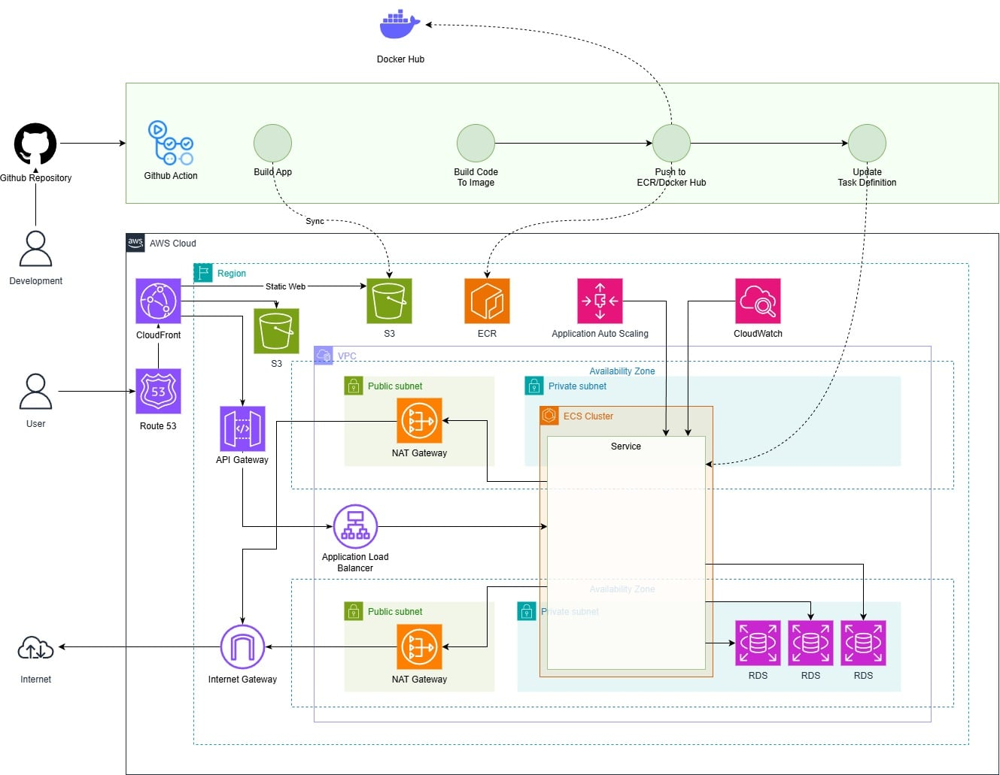

# Event Organization and Community Building Platform
## Cloud-native Solution on AWS with Microservices & AI Integration

---

Trong quá trình thực tập tại môi trường định hướng Amazon Web Services (AWS), dự án **Event Organization and Community Building Platform** được xây dựng với mục tiêu phát triển một nền tảng tổ chức sự kiện và kết nối cộng đồng hiện đại, tương tự như Luma.com, hoạt động hoàn toàn trên hạ tầng điện toán đám mây AWS.

Hệ thống cho phép người dùng tạo, quản lý và tham gia các sự kiện trực tuyến hoặc trực tiếp; quản lý cộng đồng; gửi thông báo; thống kê lượt tham gia; và tích hợp AI Chatbot nhằm hỗ trợ người dùng tra cứu thông tin sự kiện, giải đáp câu hỏi và nâng cao trải nghiệm.

Dự án được thiết kế theo kiến trúc cloud-native, đảm bảo:

- Khả năng mở rộng linh hoạt
- Tính sẵn sàng cao
- Bảo mật dữ liệu
- Tối ưu chi phí vận hành

Các dịch vụ AWS chính được sử dụng bao gồm: `Amazon S3`, `CloudFront`, `ECS`, `ALB`, `RDS`, `API Gateway`, `NAT Gateway`, `Route 53` và `CloudFormation`. Hệ thống được triển khai theo mô hình **Infrastructure as Code (IaC)** nhằm tự động hóa quá trình triển khai, dễ dàng mở rộng và bảo trì.

### Mục lục

- [1 – Mô tả vấn đề](#1-mô-tả-vấn-đề)
- [2 – Kiến trúc giải pháp](#2-kiến-trúc-giải-pháp)
- [3 – Triển khai kỹ thuật](#3-triển-khai-kỹ-thuật)
- [4 – Tiến độ & Cột mốc](#4-tiến-độ--cột-mốc)
- [5 – Ước tính ngân sách](#5-ước-tính-ngân-sách)
- [6 – Đánh giá rủi ro](#6-đánh-giá-rủi-ro)
- [7 – Kết quả mong đợi](#7-kết-quả-mong-đợi)

---

# 1. Mô tả vấn đề

## 1.1 Hiện trạng

Nhu cầu tổ chức sự kiện và xây dựng cộng đồng trực tuyến ngày càng gia tăng. Tuy nhiên, nhiều nền tảng hiện nay:

**Về phía ứng dụng**, các hệ thống hiện có thường:

- Khó mở rộng khi số lượng người dùng tăng cao, đặc biệt trong các giai đoạn cao điểm của sự kiện.
- Phát sinh chi phí vận hành lớn do hạ tầng thiếu tối ưu.
- Chưa đáp ứng tốt nhu cầu cá nhân hóa trải nghiệm người dùng.
- Thiếu sự tích hợp của các công nghệ AI nhằm hỗ trợ và tương tác với người dùng một cách thông minh.

**Ở khía cạnh người dùng**, nhu cầu thực tế ngày càng đa dạng:

- Người dùng có nhu cầu đăng tải, quảng bá và tổ chức sự kiện, nhưng thiếu một nền tảng tập trung với lượng người dùng đủ lớn để tiếp cận hiệu quả.
- Người tham gia gặp khó khăn trong việc tìm kiếm thông tin sự kiện phù hợp do giao diện phức tạp hoặc khả năng lọc và tìm kiếm còn hạn chế.
- Việc thiếu công cụ hỗ trợ thông minh khiến quá trình tra cứu thông tin mất nhiều thời gian, làm giảm trải nghiệm tổng thể.

Do đó, việc xây dựng một nền tảng có giao diện thân thiện, khả năng tìm kiếm nhanh chóng cùng với AI chatbot hỗ trợ chính xác và kịp thời là một yêu cầu cấp thiết trong bối cảnh hiện nay.

---

## 1.2. Các thách thức chính

Trong quá trình xây dựng và vận hành nền tảng tổ chức sự kiện và xây dựng cộng đồng trực tuyến, hệ thống phải đối mặt với nhiều thách thức quan trọng:

- **Quản lý lưu lượng truy cập lớn** trong thời gian diễn ra sự kiện, đặc biệt khi số lượng người tham gia tăng đột biến trong thời gian ngắn  
- **Đảm bảo hệ thống hoạt động ổn định và liên tục**, hạn chế tối đa tình trạng gián đoạn dịch vụ  
- **Bảo mật dữ liệu người dùng**, bao gồm thông tin cá nhân, dữ liệu sự kiện và lịch sử tương tác  
- **Tối ưu chi phí hạ tầng**, cân bằng giữa hiệu năng hệ thống và ngân sách vận hành  
- **Tăng cường mức độ tương tác của người dùng** thông qua việc tích hợp AI chatbot nhằm hỗ trợ tìm kiếm thông tin, tư vấn và giải đáp nhanh chóng  

---

## 1.3. Tác động đến các bên liên quan

Những hạn chế của các nền tảng hiện tại ảnh hưởng trực tiếp đến nhiều đối tượng liên quan:

- **Người tổ chức sự kiện**: Gặp khó khăn trong việc quản lý, quảng bá và theo dõi hiệu quả sự kiện, làm giảm chất lượng tổ chức  
- **Người tham gia**: Trải nghiệm không đồng nhất, khó tiếp cận thông tin sự kiện phù hợp và dễ bị gián đoạn trong quá trình sử dụng  
- **Doanh nghiệp**: Mất cơ hội mở rộng thị trường, hạn chế khả năng thu hút người dùng mới và giảm tiềm năng tăng trưởng  

---

## 1.4. Hệ quả đối với hoạt động kinh doanh

Nếu không có giải pháp phù hợp và kịp thời, các vấn đề nêu trên có thể dẫn đến nhiều hệ quả tiêu cực:

- Khó khăn trong việc **mở rộng quy mô và phát triển thị trường**  
- **Giảm mức độ hài lòng và lòng trung thành của người dùng**, ảnh hưởng trực tiếp đến uy tín thương hiệu  
- **Gia tăng chi phí vận hành** do hệ thống kém hiệu quả và thiếu khả năng tự động mở rộng  

Vì vậy, việc xây dựng một nền tảng hiện đại, ổn định, bảo mật và có khả năng mở rộng cao là yêu cầu thiết yếu để đảm bảo sự phát triển bền vững của doanh nghiệp trong môi trường số.

---

# 2. Kiến trúc giải pháp

## 2.1. Tổng quan kiến trúc

Hệ thống được thiết kế theo mô hình Cloud-native trên nền tảng AWS, áp dụng kiến trúc microservices và container hóa bằng Docker. Toàn bộ quy trình từ phát triển, triển khai đến vận hành được tự động hóa thông qua CI/CD pipeline.

Luồng hoạt động chính của hệ thống bao gồm:
- Luồng CI/CD: Source code được quản lý trên GitHub, sử dụng GitHub Actions để build ứng dụng, đóng gói Docker Image và đẩy lên Amazon ECR/Docker Hub, sau đó cập nhật ECS Task Definition.
- Luồng người dùng: Người dùng truy cập hệ thống thông qua Route 53, nội dung tĩnh được phân phối bằng CloudFront và S3, các request API được xử lý thông qua API Gateway và Application Load Balancer.
- Luồng xử lý backend: Các container backend chạy trong Amazon ECS (private subnet), kết nối với cơ sở dữ liệu Amazon RDS và được giám sát bằng CloudWatch.

Kiến trúc đảm bảo tính sẵn sàng cao, bảo mật, dễ mở rộng và phù hợp cho các hệ thống hiện đại.

---

## 2.2. Các dịch vụ AWS sử dụng

Các dịch vụ AWS chính được sử dụng trong hệ thống bao gồm:
- Amazon Route 53: Quản lý DNS và định tuyến người dùng.
- Amazon CloudFront: Phân phối nội dung (CDN) cho frontend.
- Amazon S3: Lưu trữ website tĩnh và tài nguyên frontend.
- Amazon API Gateway: Tiếp nhận và điều phối các request API.
- Application Load Balancer (ALB): Cân bằng tải cho các ECS Task.
- Amazon ECS (Elastic Container Service): Chạy các container backend.
- Amazon ECR / Docker Hub: Lưu trữ Docker Image.
- Amazon RDS: Cơ sở dữ liệu cho hệ thống.
- Amazon VPC: Thiết lập mạng riêng ảo.
- NAT Gateway và Internet Gateway: Quản lý kết nối Internet.
- Application Auto Scaling: Tự động mở rộng ECS Service.
- Amazon CloudWatch: Giám sát, logging và cảnh báo.
- GitHub Actions: Triển khai CI/CD.

---

## 2.3. Thiết kế các thành phần hệ thống

### 2.3.1 CI/CD Pipeline

Source code được lưu trữ trên GitHub. GitHub Actions tự động thực hiện các bước:
1. Build ứng dụng.
2. Build Docker Image.
3. Push image lên Amazon ECR/Docker Hub.
4. Cập nhật ECS Task Definition và triển khai phiên bản mới.

### 2.3.2 Frontend

Frontend được triển khai dưới dạng static website trên Amazon S3 và phân phối thông qua CloudFront nhằm giảm độ trễ và tăng hiệu năng.

### 2.3.3 Backend

Backend được triển khai dưới dạng container trong Amazon ECS, chạy ở private subnet và chỉ nhận traffic từ Application Load Balancer.

### 2.3.4 Database

Amazon RDS được triển khai trong private subnet, chỉ cho phép ECS Service truy cập thông qua Security Group.

---

## 2.4. Kiến trúc bảo mật

Hệ thống áp dụng nhiều lớp bảo mật:
- Phân tách public subnet và private subnet.
- ECS và RDS không có public IP.
- Security Group giới hạn luồng truy cập giữa các thành phần.
- IAM Role được sử dụng để phân quyền tối thiểu cho ECS và GitHub Actions.
- CloudFront giúp hạn chế truy cập trực tiếp vào S3.

---

## 2.5. Thiết kế khả năng mở rộng

Hệ thống hỗ trợ mở rộng linh hoạt:
- ECS Service tự động scale dựa trên CPU và Memory.
- ALB phân phối đều lưu lượng truy cập.
- Kiến trúc hỗ trợ triển khai đa Availability Zone.
- CI/CD cho phép triển khai nhanh và giảm downtime.

---

# 3. Triển khai kỹ thuật
## 3.1. Các giai đoạn triển khai

Quá trình triển khai hệ thống được chia thành các giai đoạn rõ ràng nhằm đảm bảo tính đồng bộ và giảm rủi ro trong quá trình phát triển:

#### Giai đoạn 1: Phát triển cục bộ
- Hệ thống gồm 4 microservices:
  - User + Page Service
  - AI Chat Service
  - Notification Service
  - Event Service
- Phân công nhân sự:
  - 01 thành viên phát triển User Service
  - 01 thành viên phát triển Page Service và AI Chat Service
  - 01 thành viên phát triển Notification Service và Event Service
- Toàn bộ các service được phát triển và chạy độc lập trên môi trường local của từng thành viên.
- Các thành viên thực hiện demo chéo để kiểm tra logic và luồng xử lý.

#### Giai đoạn 2: Tích hợp hệ thống
- Sau khi hoàn thành từng service, source code được gom về một máy để:
  - Chạy đồng thời toàn bộ backend services.
  - Kết nối với frontend dùng chung.
  - Kiểm thử luồng nghiệp vụ tổng thể trên môi trường local.

#### Giai đoạn 3: Triển khai thủ công lên AWS
- Các service backend được đóng gói bằng Docker.
- Triển khai thủ công lên AWS (ECS, RDS, ALB).
- Cấu hình mạng, environment variables và security group.
- Kiểm thử hệ thống trên môi trường cloud.

#### Giai đoạn 4: Tự động hóa triển khai
- Sử dụng AWS CloudFormation để mô tả hạ tầng dưới dạng mã (Infrastructure as Code).
- Chuẩn hóa quá trình deploy.
- Giảm lỗi cấu hình thủ công và tăng khả năng tái sử dụng.

---

## 3.2. Yêu cầu kỹ thuật

- Ngôn ngữ & Framework:
  - Backend: Java Spring Boot (microservices)
  - Frontend: ReactJS (dùng chung cho toàn hệ thống)
- Công nghệ:
  - Docker & Docker Compose
  - RESTful API
- Hạ tầng:
  - AWS ECS, ECR, RDS, ALB, VPC
  - CloudFormation
- Công cụ hỗ trợ:
  - Git & GitHub
  - GitHub Actions (CI/CD)
- Môi trường:
  - Local development
  - AWS Cloud environment

---

## 3.3. Phương pháp phát triển

Hệ thống được phát triển theo phương pháp:
- **Microservices Architecture**: Mỗi service đảm nhiệm một nghiệp vụ riêng biệt.
- **Phát triển song song**: Các thành viên làm việc độc lập trên từng service.
- **Incremental Development**: Hoàn thiện từng chức năng nhỏ và kiểm thử liên tục.
- **DevOps-oriented**: Kết hợp phát triển và triển khai tự động.

Frontend được phát triển chung, kết nối đến các backend service thông qua API Gateway / Load Balancer.

---

## 3.4. Chiến lược kiểm thử

Chiến lược kiểm thử được áp dụng theo nhiều mức:

- **Unit Test**:
  - Kiểm thử các hàm xử lý nghiệp vụ trong từng service.
- **Integration Test**:
  - Kiểm tra giao tiếp giữa các service và frontend.
- **Manual Test**:
  - Test trực tiếp trên môi trường local và cloud.
- **Deployment Test**:
  - Kiểm tra service sau khi deploy lên AWS.
- **Monitoring**:
  - Theo dõi log và trạng thái service bằng CloudWatch.

---

## 3.5. Kế hoạch triển khai

Kế hoạch triển khai được thực hiện theo hai bước:

#### Triển khai thủ công
- Build Docker Image tại local.
- Push image lên Amazon ECR.
- Tạo ECS Task Definition và ECS Service thủ công.
- Kiểm tra hệ thống hoạt động ổn định.

#### Triển khai tự động
- Sử dụng CloudFormation để khởi tạo hạ tầng.
- Kết hợp CI/CD pipeline để:
  - Build và push image tự động.
  - Cập nhật ECS Service khi có thay đổi code.
- Đảm bảo triển khai nhanh, nhất quán và dễ rollback.

---

# 4. Tiến độ & Cột mốc

## 4.1. Lộ trình dự án

Dự án được triển khai theo lộ trình rõ ràng, chia thành các giai đoạn tương ứng với từng tuần thực hiện:

- **Tuần 1–2**: Phân tích yêu cầu và thiết kế kiến trúc tổng thể
- **Tuần 3–4**: Xây dựng và cấu hình hạ tầng AWS
- **Tuần 5–6**: Phát triển backend và frontend
- **Tuần 7**: Tích hợp AI chatbot
- **Tuần 8**: Kiểm thử, tối ưu và hoàn thiện hệ thống

---

## 4.2. Các mốc quan trọng

Các mốc quan trọng của dự án bao gồm:

- Hoàn thành thiết kế kiến trúc và tài liệu kỹ thuật
- Triển khai thành công hạ tầng trên AWS
- Hoàn thiện các chức năng chính của backend và frontend
- Tích hợp AI chatbot và kiểm thử tương tác
- Nghiệm thu hệ thống và sẵn sàng triển khai thực tế

---

## 4.3. Các yếu tố phụ thuộc

Tiến độ dự án phụ thuộc vào một số yếu tố sau:

- Mức độ sẵn sàng của hạ tầng AWS và tài nguyên cloud
- Sự phối hợp giữa các nhóm backend, frontend và DevOps
- Thời gian tích hợp và tinh chỉnh AI chatbot

---

## 4.4. Phân bổ nguồn lực

Nguồn lực được phân bổ hợp lý theo từng giai đoạn:

- **Giai đoạn phân tích & thiết kế**: Kiến trúc sư hệ thống, phân tích viên
- **Giai đoạn xây dựng hạ tầng**: DevOps, Cloud Engineer
- **Giai đoạn phát triển**: Lập trình viên backend và frontend
- **Giai đoạn kiểm thử & hoàn thiện**: Tester và toàn bộ nhóm dự án

Cách phân bổ này giúp tối ưu hiệu quả làm việc và đảm bảo tiến độ đề ra.

---

# 5. Ước tính ngân sách

> [!WARNING]  
> Các chi phí trong phần này **chỉ mang tính ước lượng** dựa trên giả định kiến trúc và lưu lượng sử dụng. Chi phí thực tế có thể thay đổi tùy theo khu vực AWS, mức độ tối ưu hạ tầng và lưu lượng phát sinh.

### Giả định chung

> [!TIP]  
> Giả định **1.000.000 request / ngày (~30.000.000 request / tháng)** giúp đánh giá hệ thống ở mức tải trung bình – phù hợp cho đồ án, thực tập hoặc MVP.

- Lưu lượng hệ thống: **1.000.000 request / ngày**
- Kiến trúc triển khai:
  - 4 microservices backend (User + Page, AI Chat, Notification, Event) chạy trên Amazon ECS
  - 1 frontend dùng chung (ReactJS) triển khai trên Amazon S3 + CloudFront
  - Application Load Balancer và API Gateway
  - 1 Amazon RDS (Single AZ)
- Khu vực triển khai: AWS Asia Pacific (Singapore)
- Mục tiêu: MVP / hệ thống mức production trung bình

---

## 5.1. Chi phí hạ tầng (Infrastructure Cost)

### a) Compute & Container

> [!TIP]  
> ECS được chọn thay vì EC2 truyền thống để giảm chi phí vận hành và hỗ trợ auto scaling.

| Thành phần | Cấu hình giả định | Chi phí ước tính / tháng |
|----------|------------------|--------------------------|
| Amazon ECS | 4 services, mỗi service 1 task (0.5 vCPU, 1GB RAM) | ~80 USD |
| Application Load Balancer | 1 ALB + LCU | ~25 USD |

**Tổng chi phí compute:** ~**105 USD / tháng**

> [!TIP]  
> Có thể giảm chi phí compute bằng cách:
> - Giảm số task ở giờ thấp điểm
> - Sử dụng ECS Auto Scaling theo CPU/Memory
> - Áp dụng Savings Plan khi triển khai dài hạn

---

### b) API & Network

> [!WARNING]  
> API Gateway và NAT Gateway là hai thành phần **dễ phát sinh chi phí cao** nếu lưu lượng tăng đột biến.
> NAT Gateway là thành phần **chi phí cao và dễ tăng đột biến** nếu backend gọi Internet thường xuyên.

| Thành phần | Ước tính | Chi phí / tháng |
|----------|---------|-----------------|
| API Gateway | ~30 triệu request | ~90 USD |
| NAT Gateway | 1 NAT Gateway + traffic | ~35 USD |
| Data Transfer | CloudFront + ALB (~1–2 TB) | ~40 USD |

**Tổng chi phí network:** ~**165 USD / tháng**

> [!TIP]  
> Có thể tối ưu bằng cách:
> - Sử dụng VPC Endpoint cho S3/ECR
> - Giảm outbound traffic không cần thiết
> - Cache nội dung qua CloudFront

---

### c) Storage & Database

> [!TIP]  
> - Sử dụng RDS Single AZ giúp tiết kiệm chi phí trong giai đoạn đầu, có thể nâng cấp Multi-AZ khi hệ thống mở rộng.
> - Với hệ thống học tập hoặc MVP, nên dùng **Single AZ** để tiết kiệm chi phí.  
> - Multi-AZ chỉ nên bật khi yêu cầu cao về High Availability.

| Thành phần | Cấu hình | Chi phí / tháng |
|----------|---------|-----------------|
| Amazon RDS | db.t3.medium, Single AZ | ~55 USD |
| Amazon S3 | ~50 GB static files | ~1 USD |
| Amazon ECR | ~10 GB image storage | ~1 USD |

**Tổng chi phí storage & database:** ~**57 USD / tháng**

---

### d) Monitoring & CI/CD

> [!TIP]  
> - CloudWatch chỉ bật các log cần thiết để tránh phát sinh chi phí không cần thiết.
> - Nên thiết lập log retention ngắn (7–14 ngày) để tránh chi phí CloudWatch tăng cao.

| Thành phần | Chi phí / tháng |
|----------|-----------------|
| Amazon CloudWatch | ~10 USD |
| GitHub Actions | Free tier | ~0 USD |

---

### 👉 Tổng chi phí hạ tầng ước tính

> [!WARNING]  
> Tổng chi phí có thể tăng nếu:
> - Bật Multi-AZ cho RDS  
> - Tăng số lượng ECS task  
> - Lưu lượng vượt quá 1 triệu request/ngày

**~337 USD / tháng**  
(~8–9 triệu VNĐ / tháng)

---

## 5.2. Chi phí phát triển (Development Cost)

  
> Do dự án được thực hiện bởi sinh viên, chi phí phát triển chủ yếu là thời gian và công sức học tập. 
> Việc sử dụng công cụ mã nguồn mở và cloud free-tier giúp giảm đáng kể chi phí phát triển ban đầu.

| Hạng mục | Mô tả |
|--------|------|
| Nhân sự | 3 sinh viên |
| Thời gian phát triển | 2–3 tháng |
| Công cụ | Open-source, miễn phí |
| Chi phí trực tiếp | Gần như 0 USD |

---

## 5.3. Chi phí vận hành (Operational Cost)

> [!TIP]  
> - CI/CD và Auto Scaling giúp giảm đáng kể chi phí vận hành thủ công.
> - Tự động hóa deploy bằng CloudFormation giúp giảm lỗi cấu hình và chi phí vận hành lâu dài.

- Vận hành dựa trên:
  - CI/CD tự động
  - ECS Auto Scaling
  - CloudWatch Monitoring
- Không cần đội ngũ DevOps chuyên biệt.
- Chi phí vận hành đã được gộp trong chi phí hạ tầng.

👉 **Chi phí vận hành thấp**, phù hợp cho hệ thống quy mô nhỏ và trung bình.

---

## 5.4. Phân tích lợi tức đầu tư (ROI)

> [!TIP]  
> ROI của dự án không chỉ nằm ở giá trị tài chính mà còn ở giá trị học tập và khả năng mở rộng trong tương lai.

### Lợi ích đạt được

- Hệ thống có khả năng xử lý:
  - ~30 triệu request / tháng
  - Tính sẵn sàng cao, dễ mở rộng
- Giá trị học tập:
  - Thực hành AWS, Microservices, CI/CD
  - Triển khai Cloud-native thực tế
- Khả năng mở rộng:
  - Có thể tối ưu chi phí bằng Reserved Instance hoặc Savings Plan

### Đánh giá ROI

| Tiêu chí | Đánh giá |
|--------|---------|
| Chi phí | Trung bình |
| Hiệu năng | Cao |
| Khả năng mở rộng | Rất tốt |
| Giá trị học thuật | Rất cao |

---

### Kết luận

> [!WARNING]  
> Đây là mô hình chi phí phù hợp cho **đồ án, thực tập hoặc MVP**, chưa tối ưu hoàn toàn cho hệ thống thương mại quy mô lớn.

Với chi phí khoảng **337 USD / tháng**, hệ thống đáp ứng **1 triệu request mỗi ngày**, đảm bảo khả năng mở rộng, bảo mật và giá trị học tập cao.

---

# 6. Đánh giá rủi ro

> [!Note]
> Phần này đánh giá các rủi ro tiềm ẩn dựa trên kiến trúc Cloud-native triển khai trên AWS, bao gồm microservices, CI/CD, container và các dịch vụ managed như ECS, RDS, CloudFront.

---

## 6.1. Ma trận rủi ro

| ID | Rủi ro | Mô tả | Khả năng xảy ra | Mức độ ảnh hưởng | Mức rủi ro |
|----|-------|------|----------------|------------------|-----------|
| R1 | Quá tải hệ thống | Lưu lượng request tăng đột biến vượt khả năng xử lý | Trung bình | Cao | Cao |
| R2 | Lỗi deploy | CI/CD deploy sai cấu hình hoặc lỗi image | Trung bình | Trung bình | Trung bình |
| R3 | Mất kết nối CSDL | ECS không kết nối được RDS | Thấp | Cao | Trung bình |
| R4 | Tấn công bảo mật | Tấn công DDoS, truy cập trái phép | Thấp | Cao | Trung bình |
| R5 | Lỗi cấu hình mạng | Sai cấu hình VPC, Security Group | Thấp | Trung bình | Thấp |
| R6 | Lỗi dịch vụ AWS | Một dịch vụ AWS tạm thời gián đoạn | Thấp | Trung bình | Thấp |

> [!WARNING]  
> Các rủi ro mức **Cao** cần được ưu tiên xử lý ngay từ giai đoạn thiết kế và triển khai.

---

## 6.2. Chiến lược giảm thiểu rủi ro

### R1 – Quá tải hệ thống
- Sử dụng **ECS Auto Scaling** dựa trên CPU và Memory.
- CloudFront cache nội dung frontend để giảm tải backend.
- ALB phân phối đều lưu lượng đến các container.

### R2 – Lỗi deploy
- Chuẩn hóa CI/CD pipeline với GitHub Actions.
- Test local và integration test trước khi deploy.
- Áp dụng deploy từng bước (rolling update).

### R3 – Mất kết nối cơ sở dữ liệu
- Triển khai RDS trong private subnet, cấu hình Security Group chặt chẽ.
- Sử dụng connection pool trong backend service.
- Giám sát trạng thái RDS bằng CloudWatch.

### R4 – Tấn công bảo mật
- Giới hạn truy cập bằng Security Group và IAM Role.
- Không public ECS và RDS ra Internet.
- Sử dụng CloudFront để giảm nguy cơ tấn công trực tiếp vào S3.

### R5 – Lỗi cấu hình mạng
- Sử dụng Infrastructure as Code (CloudFormation).
- Review cấu hình VPC, subnet và route table.
- Test trên môi trường staging trước production.

### R6 – Lỗi dịch vụ AWS
- Thiết kế hệ thống theo hướng **managed service** để giảm rủi ro vận hành.
- Theo dõi AWS Service Health Dashboard.
- Có khả năng triển khai lại tài nguyên nhanh chóng bằng CloudFormation.

> [!TIP]  
> Áp dụng Infrastructure as Code giúp giảm đáng kể rủi ro do cấu hình thủ công và tăng khả năng tái tạo hạ tầng.

---

## 6.3. Kế hoạch dự phòng (Contingency Plan)

- **Sự cố backend**:
  - Restart ECS Task tự động.
  - Scale thêm task khi phát hiện lỗi tải.
- **Sự cố database**:
  - Backup dữ liệu định kỳ bằng snapshot RDS.
  - Có thể nâng cấp lên Multi-AZ khi cần độ sẵn sàng cao.
- **Sự cố deploy**:
  - Rollback về Task Definition phiên bản trước.
  - Giữ lại Docker Image cũ trong ECR.
- **Sự cố frontend**:
  - S3 + CloudFront đảm bảo nội dung vẫn được phân phối.
  - Có thể nhanh chóng cập nhật lại static build.

> [!WARNING]  
> Việc không có kế hoạch backup và rollback rõ ràng có thể dẫn đến mất dữ liệu và gián đoạn dịch vụ kéo dài.

---

### Kết luận

Nhìn chung, với kiến trúc Cloud-native trên AWS, các rủi ro kỹ thuật được đánh giá ở mức **thấp đến trung bình** và có thể kiểm soát tốt thông qua:
- Auto Scaling  
- Managed Services  
- CI/CD tự động  
- Infrastructure as Code  

Hệ thống phù hợp cho mục tiêu **đồ án, thực tập và MVP**, đồng thời có khả năng mở rộng và nâng cấp trong tương lai.

---

# 7. Kết quả mong đợi

## 7.1. Các chỉ số đánh giá thành công

Các chỉ số được sử dụng để đánh giá mức độ thành công của hệ thống bao gồm:

- **Hiệu năng hệ thống**
  - Thời gian phản hồi trung bình của API < 300 ms.
  - Hệ thống xử lý ổn định ~1.000.000 request/ngày.
- **Độ sẵn sàng**
  - Uptime đạt ≥ 99%.
  - Không xảy ra downtime nghiêm trọng khi deploy phiên bản mới.
- **Khả năng mở rộng**
  - ECS Service tự động scale khi tải tăng.
  - Không cần can thiệp thủ công khi lưu lượng biến động.
- **Quy trình triển khai**
  - Thời gian deploy giảm đáng kể nhờ CI/CD.
  - Giảm lỗi phát sinh do cấu hình thủ công.

> [!TIP]  
> Việc đo lường các chỉ số này có thể thực hiện thông qua Amazon CloudWatch và log của Application Load Balancer.

---

## 7.2. Lợi ích kinh doanh

Mặc dù hệ thống được xây dựng cho mục tiêu học tập và thực tập, kiến trúc vẫn mang lại các lợi ích kinh doanh rõ rệt:

- Giảm chi phí vận hành nhờ sử dụng managed services của AWS.
- Triển khai nhanh, phù hợp cho mô hình MVP hoặc startup giai đoạn đầu.
- Dễ dàng mở rộng khi số lượng người dùng tăng.
- Cải thiện trải nghiệm người dùng nhờ CloudFront và khả năng scale linh hoạt.

> [!WARNING]  
> Nếu không theo dõi và tối ưu chi phí thường xuyên, chi phí hạ tầng có thể tăng nhanh khi hệ thống mở rộng.

---

## 7.3. Cải tiến kỹ thuật

Thông qua việc triển khai hệ thống, các cải tiến kỹ thuật đạt được bao gồm:

- Áp dụng kiến trúc **microservices**, giúp tách biệt nghiệp vụ và dễ bảo trì.
- Container hóa backend bằng Docker, đảm bảo môi trường nhất quán.
- Tự động hóa toàn bộ quy trình build và deploy với GitHub Actions.
- Tăng cường bảo mật thông qua VPC, Security Group và IAM Role.
- Giám sát hệ thống theo thời gian thực với CloudWatch.

> [!TIP]  
> Kiến trúc hiện tại cho phép dễ dàng bổ sung thêm service mới mà không ảnh hưởng đến các service đang hoạt động.

---

## 7.4. Giá trị dài hạn

Về lâu dài, hệ thống mang lại các giá trị sau:

- Là nền tảng vững chắc để mở rộng thành hệ thống production quy mô lớn.
- Dễ dàng tích hợp thêm các dịch vụ mới như AI, phân tích dữ liệu hoặc notification nâng cao.
- Tăng giá trị học tập và thực hành thực tế về Cloud, DevOps và Microservices.
- Có thể tái sử dụng kiến trúc cho các dự án tương lai.

> [!TIP]  
> Với việc sử dụng Infrastructure as Code và CI/CD, hệ thống có khả năng tái triển khai nhanh chóng trên nhiều môi trường khác nhau.

---

### Kết luận

Hệ thống kỳ vọng đạt được sự cân bằng giữa **hiệu năng, chi phí và khả năng mở rộng**, đồng thời mang lại giá trị học thuật và thực tiễn cao, phù hợp cho mục tiêu **đồ án, thực tập và phát triển MVP trong tương lai**.

## Phụ lục

### Thông số kỹ thuật
- Java Spring Boot, ReactJS  
- Docker, ECS, RDS, ALB  

### Tính toán chi phí
- Ước tính theo 1M request/ngày  

### Sơ đồ kiến trúc
- Solution Architecture Diagram  

### Tài liệu tham khảo
- AWS Documentation  
- Cloud-native Architecture Best Practices
